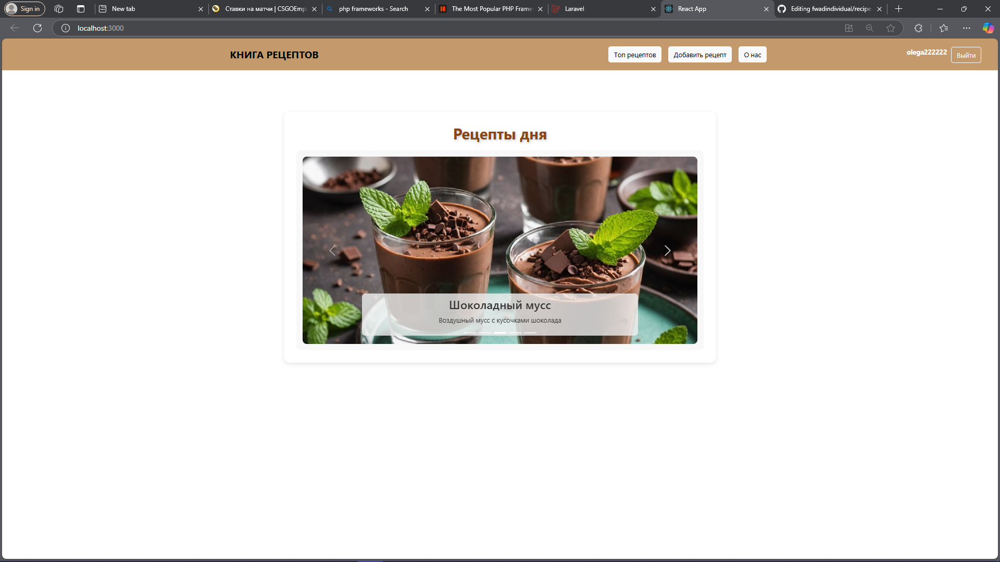

# Recipe Book

Fullstack-проект на базе Laravel (бэкенд) и React (фронт), созданный в рамках индивидуальной работы.

---

## 🚀 Как запустить проект

### 1. Клонировать репозиторий и установить зависимости

composer install
npm install

##Настроить Laravel

cp .env.example .env
php artisan key:generate

#Запустить Laravel сервер
php artisan serve

#Запустить React фронтенд

cd recipe-book-client
npm start

